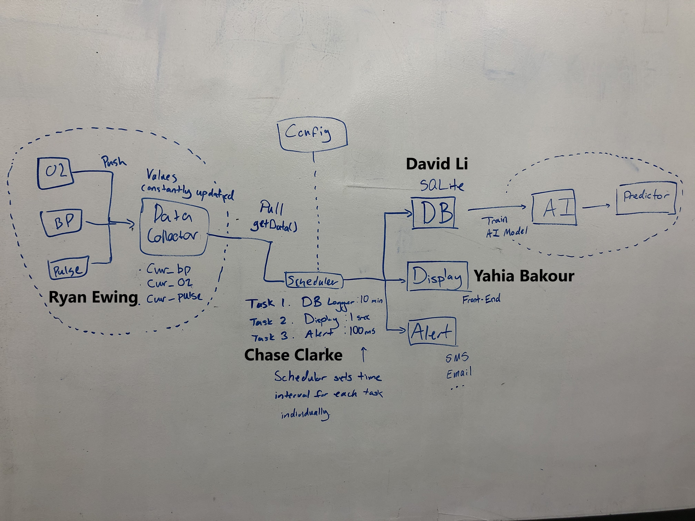
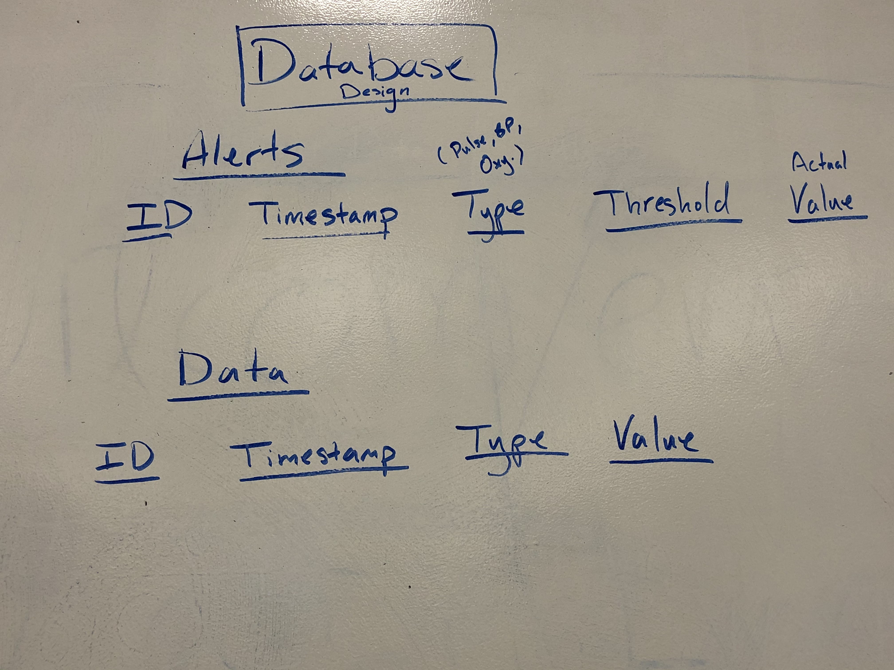
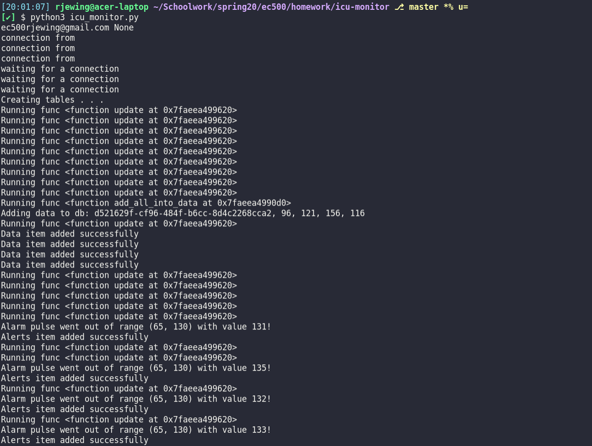
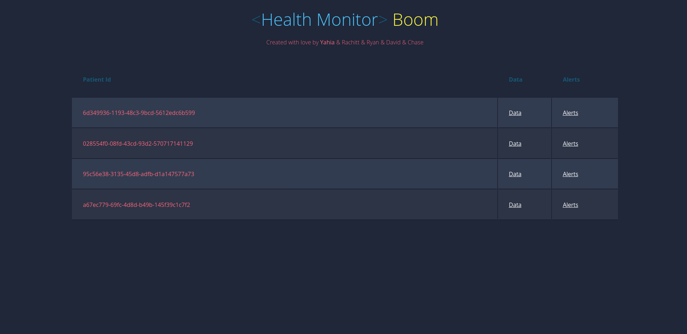
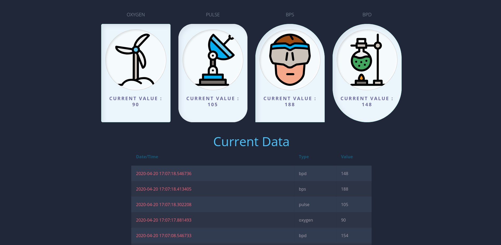
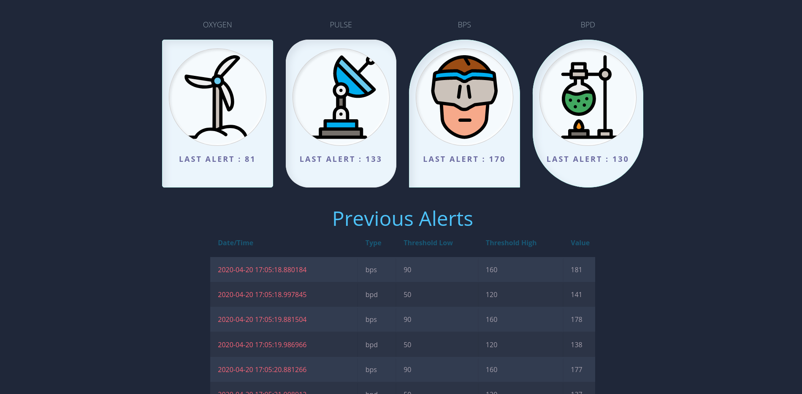

# Health Monitor

## Build Instructions
```bash
$ python3 -m venv venv
$ source venv/bin/activate
$ pip3 install -r requirements.txt
```
## How to run
1. `$ pip3 install -r requirements.txt`
2. Run as separate background processes:
   ```
    $ python3 data_generation/oxygen_collector.py &
    $ python3 data_generation/bp_collector.py &
    $ python3 data_generation/pulse_collector.py &
   ```
3. Run the main health monitor:
   ```
    $ python3 icu_monitor.py
   ```
4. Run the UI to see the data
   ```
    $ export FLASK_APP=main.py
    $ export FLASK_DEBUG=1
    $ python3 -m flask run
   ```
5. Or in one line:
   ```
   # Export the variables
   $ export FLASK_APP=main.py
   $ export FLASK_DEBUG=1
   # Run all the Python files
   $ python3 data_generation/oxygen_collector.py & python3 data_generation/bp_collector.py & python3 data_generation/pulse_collector.py & python3 icu_monitor.py & python3 -m flask run
   ```

## System Architecture
### Components
1. Vital sign monitors (simulated)
   1. Blood Pressure
   2. Oxygen
   3. Pulse
2. Data Aggregator/Vendor
3. Task Scheduler
4. Database interface
5. Alarm monitor
6. Flask UI App

We designed our application to allow for maximum scalability and expansion. By using separate processes for each monitor, we can easily add a new vital sign monitor without affecting the rest of the application. In order to add a new feature that needs access to the vital signs data, we can simply create a new task and schedule it at an appropriate interval. If we need historical data or access to recent data that is not time-critical, we expose our data through the database interface. This allows addons like the AI module without refactoring existing code.

### Process-Thread Decisions
We wanted to ensure each piece was able to be stopped and started independently of one another. This allows easy development and redeployment, as one does not have to shut down the entire application to update one small piece. In a critical use such as a health monitor, shortening the down-time during updates is very important.

Our system relies on small, independent processes. We have the following processes:

1. Oxygen monitor (simulated)
2. Blood pressure monitor (simulated)
3. Pulse monitor (simulated)
4. Scheduler
5. UI

The scheduler is used to run different tasks at configurable intervals such as database logging and alarm triggering. These tasks are run in individual threads to ensure multiple tasks can be executed simultaneously. We also have a data vendor thread that aggregates the data from each monitor and exposes it to the scheduler to pass into the tasks.

### Work Assignments and System Overview




## API Interface and Usage
### Alerts
```
# set up an alarm with a lower and upper threshold of 80 and 130
pulse_alarm = Alarm(80, 130, name="pulse")

# this will cause an alarm because the 2nd parameter (which represents pulse) is too high
pulse_alarm.check_threshold('my_patient_id', 150)

# if you want check the threshold on all pre-set alarms (oxygen, pulse, diastolic and systolic blood pressure)
# this calls check_threshold on all the default alarms
update("some_id", oxygen=50, pulse=100, bps=120, bpd=80)
```

If no alert is triggered, this module has no output and no side-effects. However, when an alarm is triggered the information is logged in the database and an email is sent if the EC500_GMAIL_EMAIL and EC500_GMAIL_PASSWORD environment variables are set. In all cases, we print a notification to the terminal notifying the user of the alert.

### Data Collector / Vendor
Setup/Inputs
```
# set up a new data vendor
vendor = DataVendor()

# start the thread that keeps values updated
vendor.start_receive()
```
Outputs
```
# get the most recent values from the vendor
values = vendor.get_values()

# values will be a tuple with the following structure
# (patient_id, bps, bpd, pulse, oxygen)
# to unpack the values into individual variables
patient_id, bps, bpd, pulse, oxygen = vendor.get_values()
```

This module gets the most recent data and stores it in-memory. It listens on Unix sockets that are exposed by the vital sign monitors. It reads from these sockets as soon as data is sent and updates the current value with the received value.

### Scheduler
```python
scheduler = Scheduler()

# or minuets=1 or hours=1 ... etc. check documentation for other input args
id = scheduler.create_job(myfunc, seconds=1)

print(scheduler.list_jobs())

scheduler.remove_job(id)
```

Note that all job creations and deletions are logged in `/scheduler/scheduler.log`

Refer to `/scheduler/example.py` for full example

All input args for `Scheduler.create_job(myfunc, args)` can be found [here](https://apscheduler.readthedocs.io/en/stable/modules/triggers/interval.html) 


The scheduler allows for automatic execution of tasks in separate threads at a custom interval. This is used to automatically run our database logging and alert checking. The scheduler allows for super simple expansion of the functionality, since we can easily add a new tasks with one line of code. The development of new tasks can be done completely independently of the scheduler until the task is ready to be put into production.

### Database interface
The database interface has all normal CRUD functions to allow easy Python access to the database. Additionally, it has service level functions such as:
* add_alerts_item(patientID, entrytype, threshold_low, threshold_high, value)
* add_all_into_data(patientID, oxygen=None, pulse=None, bps=None, bpd=None)

that are specifically used in our database logging task and alert task.

### Example of application running
#### ICU Monitor and Scheduler


#### UI
The UI relies on the database CRUD functions to populate its data dynamically. It will automatically fetch the newest data upon loading the website, along with historical data for each patient.

</img>

</img>

</img>

## Demo
You can see a demo of our UI displaying the generated data in `./docs/Demo_UI_Health_Monitor.mov`. The data shown is updated every 10 seconds while the alerts are updating every second.